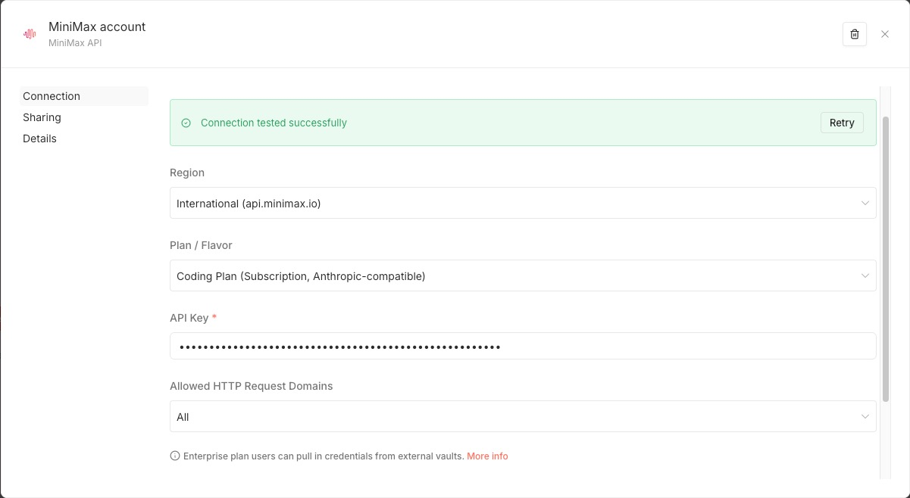
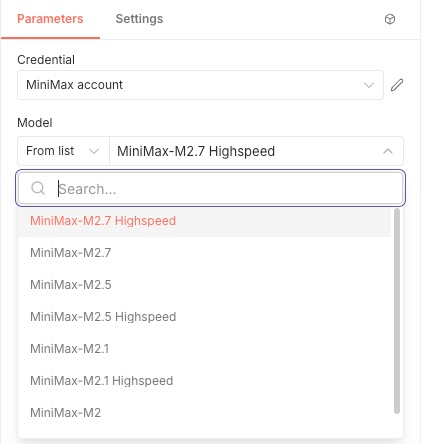
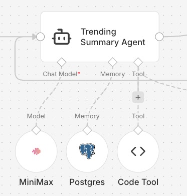

# n8n-nodes-minimax-unified

[](https://www.npmjs.com/package/n8n-nodes-minimax-unified)
[](https://www.npmjs.com/package/n8n-nodes-minimax-unified)
[](https://github.com/xi0yu/n8n-nodes-minimax-unified/actions/workflows/ci.yml)
[](./LICENSE)

An [n8n](https://n8n.io) community node for [MiniMax AI](https://platform.minimaxi.com/). It exposes MiniMax chat-completion endpoints as regular n8n nodes and as a Language Model node usable inside AI Agent / Chain workflows.

This package was created because existing MiniMax community nodes do not cover both regions and the newer models at the same time — see [Why another package?](#why-another-package) below.

## Table of contents

- [Features](#features)
- [Install](#install)
- [Credentials](#credentials)
- [Nodes](#nodes)
- [Screenshots](#screenshots)
- [Why another package?](#why-another-package)
- [Troubleshooting](#troubleshooting)
- [Build from source](#build-from-source)
- [License](#license)

## Features

- **Dual region** — pick `International (api.minimax.io)` or `China (api.minimaxi.com)`, matching where your API key was issued.
- **Standard and Coding Plan** — Standard uses the OpenAI-compatible endpoint (`/v1/text/chatcompletion_v2`); Coding Plan uses the Anthropic-compatible endpoint (`/anthropic/v1/messages`).
- **Custom Base URL** — point at a proxy or private deployment.
- **Model picker with free-form input** — choose a known model from the list, or type any model ID your account supports (so new models work without waiting for a package update).
- **Two nodes** — a regular `MiniMax` node and a `MiniMax Chat Model` node for AI Agent / Chain.
- **Bearer prefix handled for you** — paste the raw key; `Bearer ` is added automatically and stripped if pasted by mistake.

Bundled model list: `MiniMax-M2.7`, `MiniMax-M2.7-highspeed`, `MiniMax-M2.5`, `MiniMax-M2.5-highspeed`, `MiniMax-M2.1`, `MiniMax-M2.1-highspeed`, `MiniMax-M2`, `M2-her`. Any model ID outside this list can still be used via the free-form input.

## Install

### Option 1 — n8n Community Nodes (recommended)

In n8n: **Settings → Community Nodes → Install** and enter:

```
n8n-nodes-minimax-unified
```

### Option 2 — Local custom extension

```bash
git clone https://github.com/xi0yu/n8n-nodes-minimax-unified.git
cd n8n-nodes-minimax-unified
npm install
npm run build
mkdir -p ~/.n8n/custom
ln -s "$(pwd)" ~/.n8n/custom/n8n-nodes-minimax-unified
# restart n8n
```

## Credentials

Create a credential of type **MiniMax API**:

| Field | Notes |
|---|---|
| Region | `International (api.minimax.io)`, `China (api.minimaxi.com)`, or `Custom Base URL` |
| Custom Base URL | Only shown when Region = Custom. Base URL with no trailing slash. |
| Plan / Flavor | `Standard (Pay-as-you-go, OpenAI-compatible)` or `Coding Plan (Subscription, Anthropic-compatible)` |
| API Key | Paste the raw key. Do **not** include `Bearer ` — the node adds it automatically. |
| Group ID | Optional. Appended as a `GroupId` query-string parameter on Standard endpoints. Coding Plan does not use it. |

> Standard keys and Coding Plan keys are issued separately in the MiniMax console and are **not** interchangeable. Make sure the Plan field matches the key you generated.

## Nodes

This package ships two nodes:

### `MiniMax`

A regular node for chat completion. Use it when you want full control over the request (messages array, temperature, etc.) in a normal workflow.

- Resource: `Chat`
- Operation: `Complete` → `POST /v1/text/chatcompletion_v2` (Standard) or `POST /anthropic/v1/messages` (Coding Plan)
- Model: resource locator with searchable list + free-form input

### `MiniMax Chat Model`

A Language Model sub-node intended for use with **AI Agent** and **Chain** nodes. Internally it uses:

- `@langchain/openai` when the credential's Plan is `Standard`
- `@langchain/anthropic` when the credential's Plan is `Coding Plan`

You plug it into an AI Agent's `Language Model` input the same way you would plug in an OpenAI or Anthropic chat model.

## Screenshots







## Why another package?

A few MiniMax community nodes already exist. Each is useful; this package was built to fill gaps observed at the time of writing:

- **[`n8n-nodes-minimax-chat`](https://www.npmjs.com/package/n8n-nodes-minimax-chat)** hardcodes the international endpoint (`api.minimax.io`) in its credential test and request routing. Keys issued on the China console (`platform.minimaxi.com`) fail the credential test with `401 Authorization failed`.
- **[`n8n-nodes-minimax`](https://www.npmjs.com/package/n8n-nodes-minimax)** supports both regions and Coding Plan correctly; its bundled model list stops at `MiniMax-M2.5` and newer IDs such as `MiniMax-M2.7` are not selectable from the built-in dropdown.

The main additions in this package are:

- Up-to-date bundled model list, including `MiniMax-M2.7` and its highspeed variant.
- Free-form model input alongside the dropdown, so any future model ID works without waiting for a package update.

Those are the only meaningful differences to be aware of. If the packages above add equivalent support, the credential shape here is deliberately similar so you can switch with minimal rework.

## Troubleshooting

**`401 Authorization failed` on credential test.**
Check the Region field. An `api.minimax.io` key will not authenticate against `api.minimaxi.com` and vice versa. Also double-check the Plan field: a Coding Plan key will fail against the Standard endpoint.

**`Unknown model` / 400 error.**
If you typed a model ID in the free-form input, verify it is enabled on your MiniMax account. The dropdown only lists models this package knows about; the API enforces what your account can actually use.

**Coding Plan returns content but AI Agent output looks empty.**
AI Agent and Chain nodes expect OpenAI-style output shapes. When using Coding Plan, the node uses `@langchain/anthropic` internally to adapt Anthropic responses, so most agent flows work. If you see empty output, please open an issue with the workflow JSON attached.

**The package is not showing up in `npm search` yet.**
The npm search index lags behind publication by several weeks for new packages. `npm install n8n-nodes-minimax-unified` works regardless, as does the n8n Community Nodes installer.

## Build from source

```bash
npm install
npm run build    # compile TS + copy icons into ./dist
npm run verify   # sanity-load the compiled nodes and credentials
```

## License

[MIT](./LICENSE)
